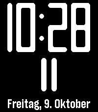
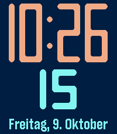

# Norl T2

Watchface für die Pebble Time 2: eine große Stundenziffer, darunter eine Skala, die sich mit den Minuten füllt. Schütteln zeigt für ein paar Sekunden die genaue Uhrzeit mit Sekunden und das Datum, groß genug zum Ablesen ohne Brille.

Nachbau von [Norl](https://apps.repebble.com/norl_545cbf8d8d7292ab7a000044) (Matteo Piccina, ursprünglich von Jose Fos, 2014). Das Original ist für 144 × 168 Pixel gebaut und läuft auf der Time 2 nur hochskaliert. Hier sind die Ziffern als Vektoren neu gezeichnet, in voller Auflösung und in frei wählbaren Farben.

Plattform: emery (Pebble Time 2).

   

## Installieren

`build/norl.pbw` aufs iPhone bringen, etwa per AirDrop, und in der Pebble-App öffnen. Danach auf der Uhr unter „Watchfaces“ auswählen.

## Bedienung

* **Normalansicht:** Die Stunde füllt den Bildschirm, die Skala unten zeigt die Minuten. Striche alle 5 Minuten, längere bei 15 und 45, der längste bei 30.
* **Schütteln** (kurz das Handgelenk drehen): Stunden und Minuten, darunter die Sekunden, unten Wochentag und Datum. Nach der eingestellten Zeit geht es zurück, nochmal schütteln schließt sofort.

## Einstellungen

In der Pebble-App auf dem iPhone beim Watchface auf das Zahnrad tippen.

| Feld | Standard | |
|---|---|---|
| Hintergrund | Schwarz | |
| Ziffern | Weiß | Stundenziffer und Uhrzeit in der Detailanzeige |
| Minutenskala, Sekunden und Datum | Weiß | |
| Stunden | wie in der Uhr eingestellt | 12 oder 24 Stunden |
| Detailanzeige nach dem Schütteln | 10 Sekunden | 5, 10, 15 oder 30 Sekunden |

## Technik

* `src/c/glyphs.c` zeichnet die Ziffern. Jede besteht aus Balken mit runden Enden, angeordnet wie bei einer 7-Segment-Anzeige, die Innenecken werden ausgerundet. Die Maße stammen aus den Bildern des Originals: Strichstärke rund 18 % der Ziffernhöhe, die 1 ist nur einen Strich breit und steht dicht an der Nachbarziffer.
* Bei zweistelligen Stunden werden die Ziffern schmaler und die Striche bei Bedarf dünner, damit die Löcher offen bleiben.
* Das Watchface zeichnet einmal pro Minute neu. Nur solange die Detailanzeige zu sehen ist, läuft es im Sekundentakt.
* Einstellungen kommen über [Clay](https://github.com/pebble-dev/clay) und werden auf der Uhr gespeichert.

## Bauen

```bash
pebble build
pebble install --emulator emery
pebble emu-tap --emulator emery   # Schütteln simulieren
```
